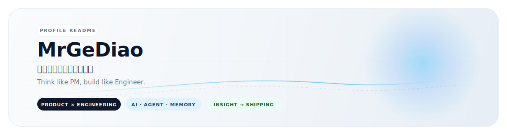
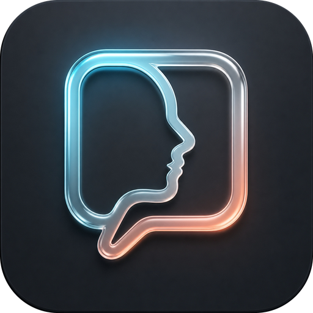
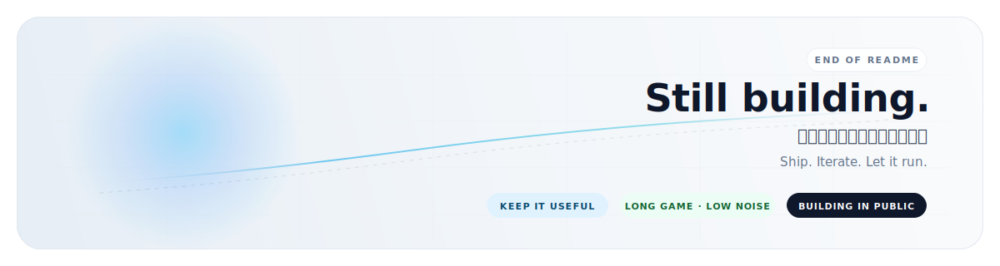

  
  
  
  

  

---

我做产品出身，后来越来越多地把想法自己写出来、接上、部署好，再看它在真实使用里哪里会断。

比起先列技术栈，我更关心一个问题：这件事是不是真的值得做。值得做，再把它拆小，尽快做出能验证的版本。

  
  
  

## 关注方向

- **AI 工具产品化** · 工具要能进入真实工作流，而不是只在 demo 里好看
- **Agent 系统** · 任务怎么拆、上下文怎么传、失败之后怎么恢复
- **Memory System** · 什么值得记、怎么检索、什么时候应该更新或忘掉
- **全栈落地** · 从产品判断到前后端实现、接入、部署和日常维护
- **中文 AI 体验** · 让 AI 输出更贴近中文语境，少一点模板腔和翻译腔

## 🧰 Tech Stack

| 维度 | 具体 |
|:--|:--|
| **Languages** |       |
| **AI & LLM** |       |
| **Infra & Ops** |        |

## 📊 GitHub at a Glance

  
  

  

## ⭐ 代表作品 · shuorenhua

<table>
<tr>
<td width="120" align="center" valign="top">

</td>
<td valign="top">

**[shuorenhua](https://github.com/MrGeDiao/shuorenhua)** · 中文优先的 AI 输出修正工具（rewrite skill）

它处理的是一个很日常的问题：AI 写出来的内容经常语法没错，但不像真实的人在那个场景里会说的话。

</td>
</tr>
</table>

| | |
|:--|:--|
| **解决什么问题** | 把 AI 生成内容里的模板腔、表演感和翻译腔压下去 |
| **方法独特在哪** | 先保护事实、术语、代码和引用，再处理风格 |
| **为什么代表我的做事方式** | 从真实使用里的不适感开始，把模糊感受拆成可以执行、评测和迭代的规则 |

## 🚧 正在推进

**OpenClaw · AI infra & ops**

模型接入、代理、部署、监控、运维，以及系统真的跑起来之后才会暴露的问题。

**Agent Memory System**

长任务里的上下文组织、记忆检索、状态延续，以及多轮协作时的信息损耗。

这些方向我还在日常使用里继续打磨。等边界更清楚、失败场景也能讲明白之后，再慢慢整理成可复用的项目或文档。

## ⚙️ 做事方式

- 先判断问题值不值得做，再决定怎么做
- 先做最小可用版本，再扩展复杂度
- 先保住事实和语境，再处理风格和体验
- 交付之后继续看部署、回滚、维护和长期稳定性

## ✨ 一句原则

> 把模糊想法变成清晰方案，再把清晰方案做成能交付、能运行的东西。
>
> Product sense decides **what to build**.
> Engineering decides **whether it can actually ship**.

## 🌟 Star History

  

## 📮 Contact

  

---

