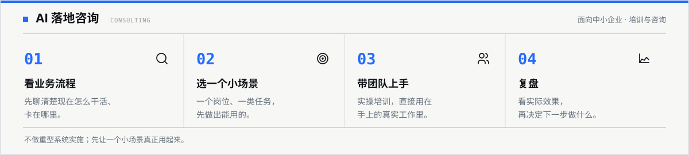

Ex–big-tech product manager, now building and maintaining my own AI tools. I also help small businesses put AI to work.

## 关于我 ABOUT

以前在大厂做产品经理。现在碰到值得做的问题，我会自己从需求一路做到代码、上线和维护，平时主要用 Claude Code 和 Codex 干活。

我在意模型交出来的东西靠不靠得住：改过的文字有没有丢掉原意，几个 agent 一起干活时谁来负责，调用的模型是不是你点名的那个。手上的项目大多围着这几个问题。另外也在给中小企业做 AI 落地的咨询和培训。

<table>
  <tr>
    <td width="50%" valign="top">
      
       
      Claude Code · Codex · Grok CLI · OpenClaw · MCP
    </td>
    <td width="50%" valign="top">
      
    </td>
  </tr>
</table>

## 代表作 FLAGSHIP

&nbsp;

`说人话` 是一个中文优先的去 AI 味改写 skill，起因是我自己受不了 AI 腔。它先保住事实、数字、条件和作者的口气，再删套话和重复铺垫；原文没问题就不改。每次发版都跑评测集回归，我自己的 `x-pipeline` 每天也用它处理候选稿。

## 其他在做的 OTHER WORK

前四个仓库暂时没有公开。[`paper-reading-zh`](https://github.com/MrGeDiao/paper-reading-zh) 已经开源，支持 Codex、Claude Code、Claude Project 和 ChatGPT Project。

展开看私有项目细节

### `santi` / 三体

我不喜欢几个 agent 同时改一堆文件，最后没人真正负责。`santi` 把角色固定下来：Codex 是唯一写入方；Claude Code 负责设计和主审；Grok 单独查风险。每一轮都会核对实际用了哪个模型，最后仍然要靠测试、repro、lint 和源码证据放行。

### `model-forensics`

它回答一个很朴素的问题：你点名的模型，真的在干活吗？工具读取本地 CLI 会话工件和代理日志，按 E0–E4 给证据分级，再生成带源文件哈希的回执，方便第三方复核。它只检测和报告，不替用户切模型；行为证据属于统计判断时，会给出置信度。

### `x-pipeline`

我自己的 X 候选稿流水线：从 X List 选题，经过选题闸、三稿起草、批量评审、去 AI 味和确定性校验，每天三次把候选稿送到飞书。我会标记“已发”或“废”，系统每周汇总发布率和废稿原因。它只读 X，从来不自动发推。

### `DreamMem`

静态规则文件容易越写越长，托管记忆服务又说不清为什么召回了某条内容。`DreamMem` 用 Markdown / YAML 保存事实，SQLite 只做可重建的索引；新记忆先成为候选，经过 review 才进入长期记忆。召回时综合向量、全文检索、时间和可信度。

## AI 落地咨询 CONSULTING

面向中小企业做 AI 落地的培训和咨询。有合作或交流的想法，欢迎发邮件。

---

