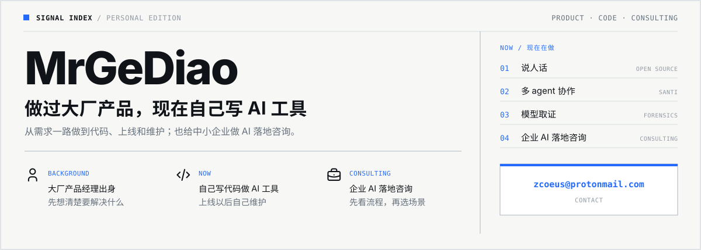
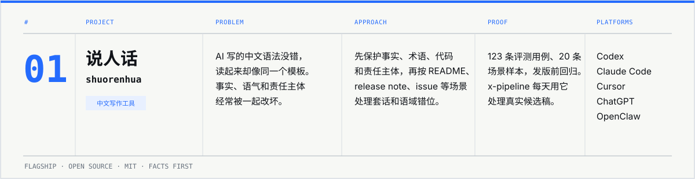
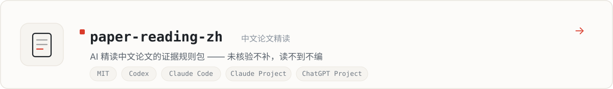
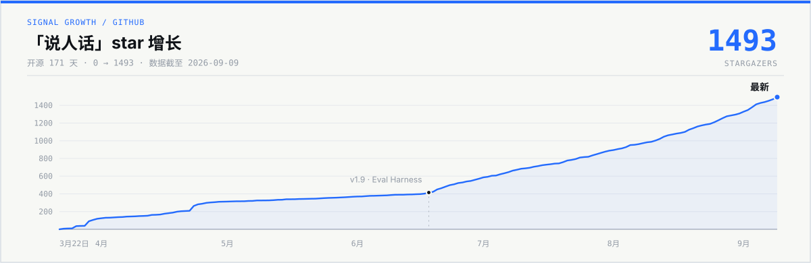
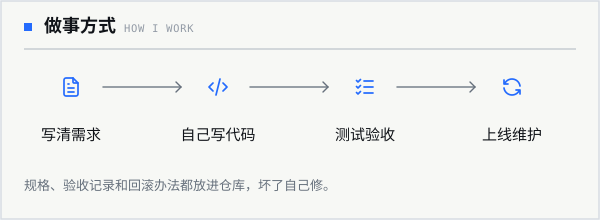
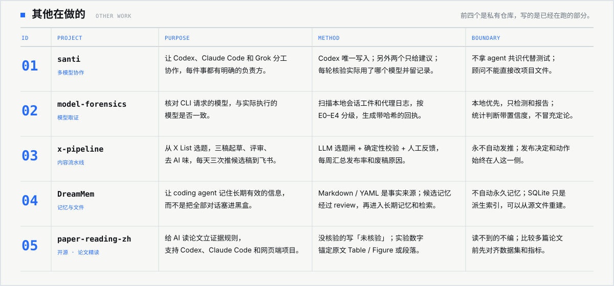
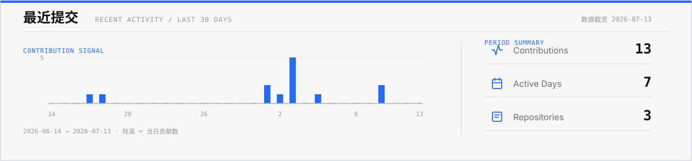

产品经理出身。现在遇到值得做的问题，我习惯自己把它走完：需求和边界自己写清楚，代码自己写，模型自己接，上线自己盯，坏了自己修。

我最近做的东西大多围着同一类麻烦：模型说的话能不能信，多 agent 合作时谁来负责，记忆和自动化怎样不变成黑盒。公开仓库是整理好给别人用的工具；私有仓库更像我的实验场和生产系统。

## 公开作品 PUBLIC WORK

&nbsp;

`说人话` 从我自己受不了的 AI 腔开始。它的规矩是先保住事实、术语、代码和责任主体，再按 README、release note、issue 回复、日常聊天这些场景收拾套话和语域错位——顺序不能反。有没有用不靠感觉判断：benchmark、真实样本，再加上它在 `x-pipeline` 里长期处理真实候选稿的结果。

&nbsp;

`paper-reading-zh` 管的是 AI 读论文时不懂装懂的毛病。规矩很简单：读不到的不编，没核验的不写成定论；每条结论都要能回到原文、图表或可核对的来源，跨论文比较先把对象、指标、样本范围和实验条件对齐。覆盖 Codex、Claude Code、Claude Project 和 ChatGPT Project。

## 工具箱与工作流 TOOLS & WORKFLOW

<table>
  <tr>
    <td width="50%" valign="top">
      
       
      Claude Code · Codex · OpenClaw · Claude API / OpenAI API · MCP
    </td>
    <td width="50%" valign="top">
      
    </td>
  </tr>
</table>

## 私有研究项目 PRIVATE WORK IN PROGRESS

下面这些仓库暂时没有公开。这里写的是已经做出来的部分，不是路线图，也不是预告。

展开看项目细节

### `santi` / 三体

我不喜欢几个 agent 同时改一堆文件，最后没人真正负责。`santi` 把角色固定下来：Codex 是唯一写入方；Claude Code 负责设计和主审；另一个模型只查风险。每个 pass 都会核对实际使用的模型，最后仍然要靠测试、repro、lint 和源码证据放行。

### `model-forensics`

它回答一个很朴素的问题：你点名的模型，真的在干活吗？工具会读取本地 CLI 会话工件和代理日志，按 E0–E4 给证据分级，再生成带源文件哈希的回执，方便第三方复核。它只检测和报告，不自动替用户切模型；行为证据属于统计判断时，会明确给出置信度。

### `DreamMem`

静态规则文件容易越写越长，托管记忆服务又很难解释为什么召回了某条内容。`DreamMem` 用 Markdown / YAML 保存事实，SQLite 只做可重建的索引；Dreaming 管线先产出候选记忆，经过 review 才会进入长期记忆。召回时混合向量、FTS5、时间和可信度，不把所有对话自动永久保存。

### `x-pipeline`

这是我自己的 X 候选稿流水线：从 X List 选题，经过选题闸、三条起草路线、批量评审、去 AI 味和确定性校验，再把候选稿送到飞书。人工会标记“已发”或“废”，系统每周汇总发布率和废稿原因。它永远不会自动发推，发布决定和动作始终在人这一侧。

### `OpenClaw engineering`

这个仓库维护我自己的 OpenClaw 生产环境。配置、脚本、workspace、升级记录和 runbook 都以仓库为准；升级先生成可审查的 staging，再事务式激活，失败会自动回滚。线上变更要先写清影响、回滚和验收，secret 与仓库内容分开管理。

### `network-proxy-rules`

家里六个代理客户端各改各的，规则很快就对不上。现在只有一份配置源，跑一次脚本生成 OpenClash、Clash、Stash、Surge、Quantumult X、Shadowrocket 六家的产物，静态校验和回归测试跟着生成链一起跑。推到路由器前先 dry-run 和备份，失败自动回滚。手改生成出来的文件不算修复——下次生成就被覆盖，改动必须回到配置源。

### `taobeibei-project`

一次外部合作的需求与方案资料库。原始录音、平台导出和沟通记录只读留存，不覆盖也不替换；产品方案以 Markdown 为源稿，其他分发格式都从它生成；要核对事实就回到原始证据，不从生成稿的表述反推结论。资料本身涉及对方业务，仓库保持私有。

## 最近提交 RECENT ACTIVITY

---

