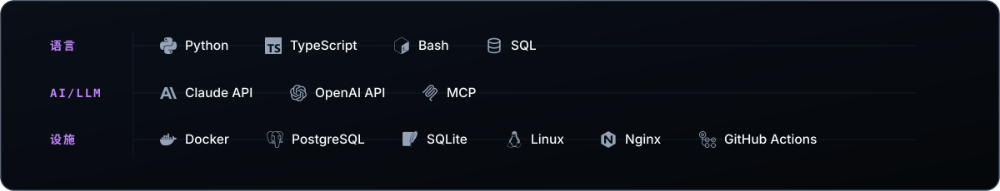

产品经理出身，现在习惯把想法自己做出来：写前端也写后端，接模型、部署上线，出了问题自己修。

动手之前先判断这件事值不值得做。值得做，就先做一个最小能用的版本，放进真实工作流里看哪里会断，再决定要不要加复杂度。部署、回滚和之后的日常维护，也都算在「做完」里。

## 项目

AI 写出来的内容经常语法全对，但不像人在那个场景下会说的话。它先把事实、术语、代码和引用保护起来，再处理模板腔和表演感——这个顺序不能反。装进 Codex、Claude Code、Cursor 或 ChatGPT 就能用。

针对的是 AI 读论文最容易滑过去的地方：读不到的内容不硬补，没核验的外部事实不写成已确认，多篇论文比较之前先确认各家的指标和定义是同一套。Agent Skill 和 Web Prompt Kit 两种入口，覆盖 Codex、Claude Code、Claude Project 和 ChatGPT Project。

## 技术栈

## 正在做

- Agent 的记忆和长任务：什么值得记、怎么检索、多轮协作时信息怎么不丢。
- AI 工具的评测和发布：把「感觉好一点」变成可以复查的样本、边界和失败案例，讲清楚边界再发布。

  <a href="https://star-history.com/#MrGeDiao/shuorenhua&MrGeDiao/paper-reading-zh&Date">
    <picture>
      <source media="(prefers-color-scheme: dark)" srcset="https://api.star-history.com/svg?repos=MrGeDiao/shuorenhua,MrGeDiao/paper-reading-zh&type=Date&theme=dark"/>
      
    </picture>
  </a>

## 联系

[zcoeus@protonmail.com](mailto:zcoeus@protonmail.com)

